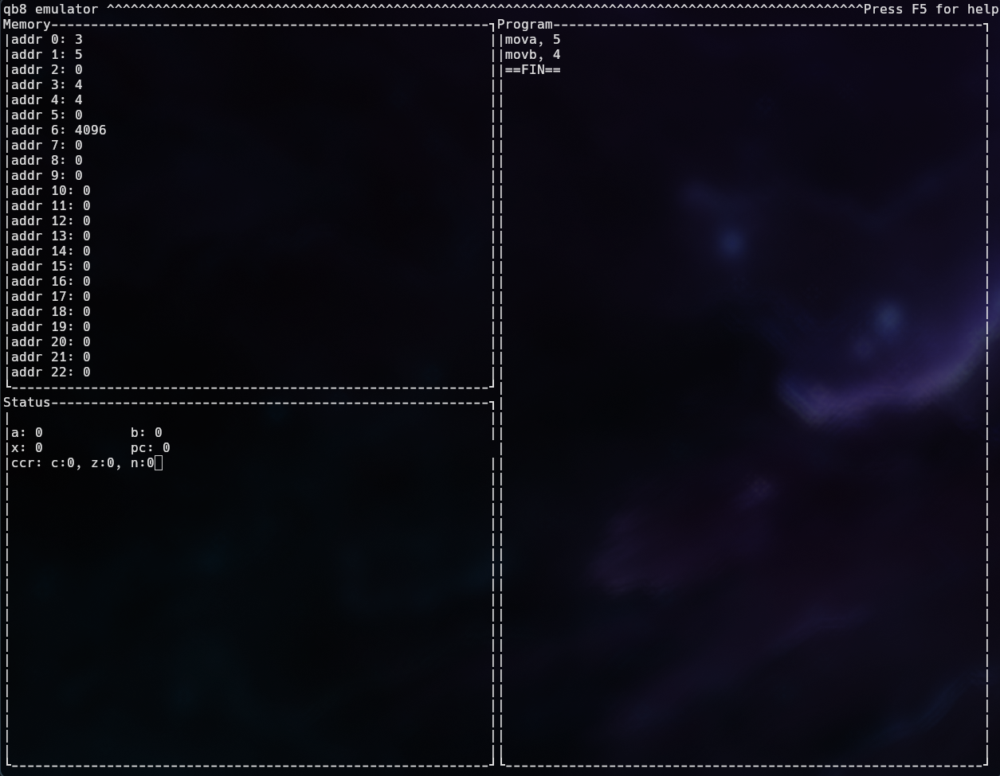

# qb8

qb8 is a CPU architecture I made for fun. It isnt very good but I made an assembler and emulator for it.

You can read about the architecture in the `ARCHITECTURE.md` file.

## qbas

qbas is the assembler for the qb8 architecture. It reads the file specified by the `src` macro in the `main.c` file. I couldn't be bothered to implement arguments. By default `src` is set to `bin.as`. Input your code into the file and hopefully the assembler will do it's work successfully/warn you of any syntax errors. The assembled binary will be in the `bin.out` file

## qb8 emulator

qb8 emulator is an emulator for the qb8 architecture. It reads a binary file defined by the `bin` macro which is by default set to `bin.out`. It features a TUI interface made in `ncurses` with which you can run qb8 programs and view their inner workings

# Screenshot
